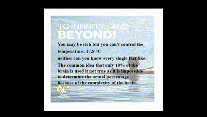

# Portfolio
[Forked link](https://github.com/QuinttAdam/dev5-portfolios-2023)
##  Lab1
[Github link](https://github.com/QuinttAdam/lab1_brittadam_quinttadam)
[Codesanbox link](https://8z9dym.csb.app/)
##  Lab2
[Github link](https://github.com/QuinttAdam/lab2)
[Codesanbox link](https://n2ty9y.csb.app/)
##  Lab3
[Github link](https://github.com/QuinttAdam/lab3)
[Codesanbox link](https://yfn95d.csb.app/)
### Als er een cors probleem is omdat de demo niet werkt, is hier een gif van hoe het werkt(zoals besproken in de les)

##  Lab4
[Github link](https://github.com/QuinttAdam/nodejs-messages-api-2)
[Codesanbox link](https://xldmz2.csb.app/)
##  Lab5
[Github link](https://github.com/QuinttAdam/tiktok)
[Vercel link](https://tiktok-zeta-flax.vercel.app/)
##  Lab6
gif:

[Github frontend link](https://github.com/QuinttAdam/lab6_frontend)
[Github backend link](https://github.com/QuinttAdam/lab6_backend)
[Vercel link](https://lab6-frontend-snowy.vercel.app/#/)
